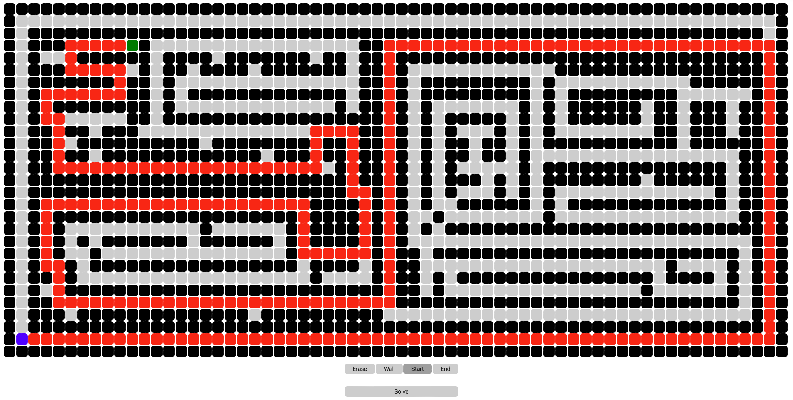

# Maze
## Overview
This .NET Core application demonstrates different search algorithms with user built mazes. 

## Usage
Build and run the application with `dotnet` by executing  `dotnet build && dotnet run`.  
Once running, the app can then be accessed at [https://localhost:7238](https://localhost:7238).

## Future Improvements
Currently, BFS is the only algorithm implemented. Future development will include more search algorithms, better visualization, and additional features. 